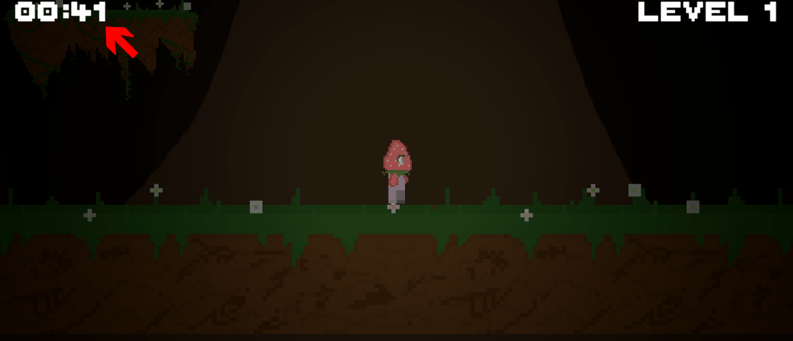
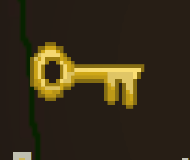
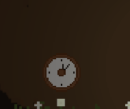
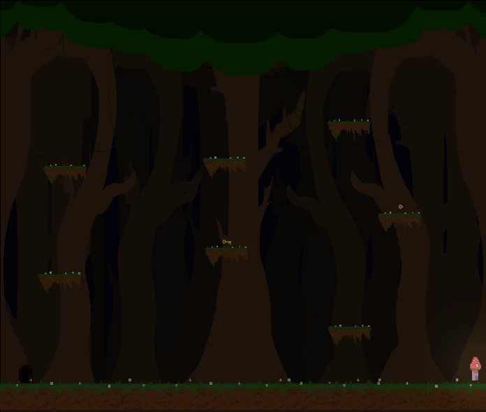
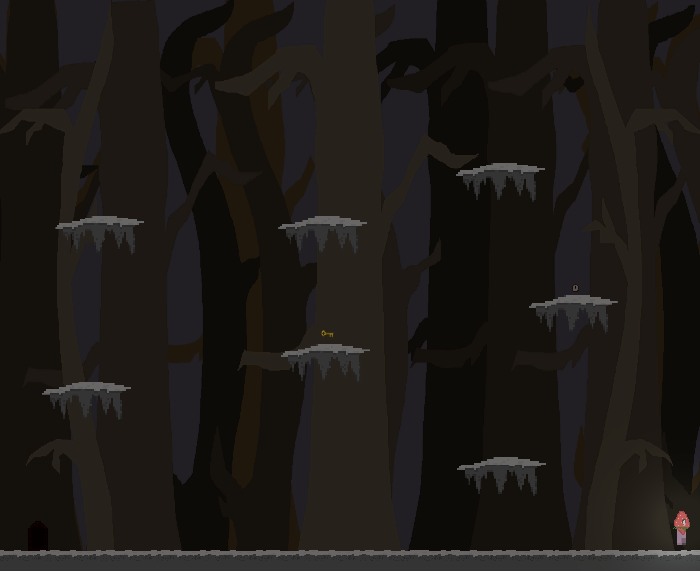
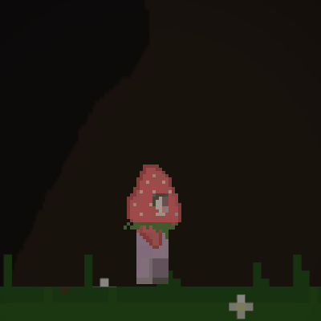
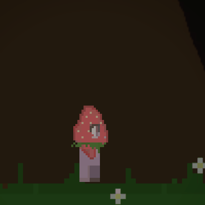

# 
 :grapes:  Berry Bounce  :strawberry:

<!-- Table of Contents -->
- [Description](#description)
- [Objective](#objective)
- [Controls](#controls)
  - [Keyboard](#keyboard)
  - [Controller](#controller)
- [Current Features](#features)
  - [Timer Display](#timer-display-ui)
  - [Level Display](#level-display-ui)
  - [Collectables](#collectables)
  - [Moving Platforms](#moving-platforms)
  - [Themed Environments](#themed-environments)
  - [Smooth Level Transitions](#smooth-level-transitions)
  - [Main Menu and Death Screen]()
- [Player](#player)
  - [Animatons](#animations)

---

## Description
Berry Bounce is a 2D platformer made in Unity that tests the player's ability to reach the end level whilst having enough time to complete all objectives. There is no traditional healthbar, rather the player's time will slowly decrease and once it reaches zero, the player loses. The game will increase in difficulty as you progress through levels with some levels introducing new mechanics such as moving platforms. Throughout the entire game the player's vision will be limited with only the immediate surroundings being visible.   

### Objective
Reach the end of all the levels whilst keeping your current time in mind. Some levels may require collecting keys scattered around the map to progress to the next level. There are also collectables around each map shaped as clocks which can add to your current time so try to look for them as your time runs low. Once you are sure you have collected all keys within a level, you should find the exit which looks something like a door/tunnel. 

### Development Process
The development process was full of bugs and errors with many issues arising in regards to player animations, colliders and hitboxes, sprite sizes and scripting bugs. Whilst most issues were in some form fixed in the end, there are still a few issues in the game outlined below.

- **Screen Tearing (Fixable with sprite atlas)**
- **Platform Collider Shapes**
- **Player Animations (Sprites being different sizes and blurry)**
- **Level Display not updating properly sometimes**

There have also been some features that were not implemented in time but were imagined to be within the game, also outlined below.

- **Level Selection Menu**
- **Enemy AI**
- **More Abilities, Powerups and Collectables**
- **Better Movement Physics**

---

## Controls

#### Keyboard     

| Key Bind | Action |
| ----------- | ----------- |
| <kbd>A</kbd> | Move Left |
| <kbd>D</kbd> | Move Right |
| <kbd>Q</kbd> | Dash |
| <kbd>Spacebar</kbd> | Jump |

#### Controller

| Key Bind | Action |
| ----------- | ----------- |
| . | . |
| . | . |
| . | . |
| . | . |
---

## Current Features
- [UI Display Elements](#timer-display-ui)
- [Collectables](#collectables)
- [Moving Platforms](#moving-platforms)
- [Themed Environments](#themed-environments)
- [Smooth Level Transitions](#smooth-level-transitions)
### Timer Display UI
#### Static

#### Counting Down

### Level Display UI

### Collectables
| Key Collectable | Clock Collectable |
| ----------- | ----------- |
| |  |

### Moving Platforms

### Themed Environments
#### Forest

#### Snowy Forest

#### Cave Environment [TODO]

### Smooth Level Transitions

### Main Menu 

## Player
### Animations
| Player Idle | Player Run |
| ----------- | ----------- |
|  |  |

#### Player Jump

#### Player Death
